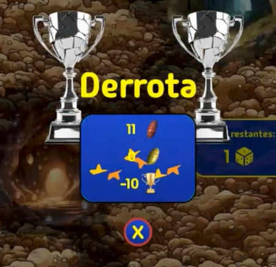
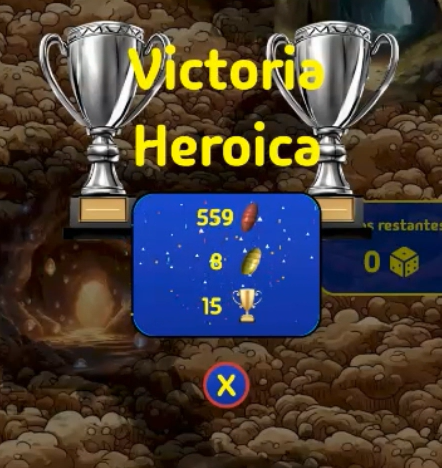
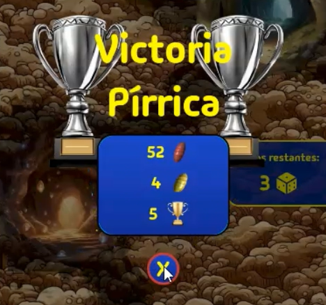
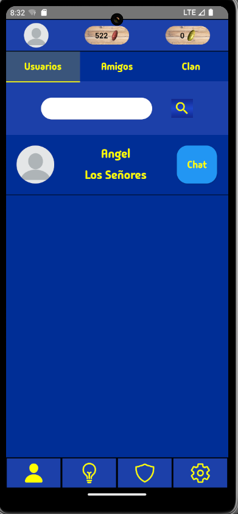
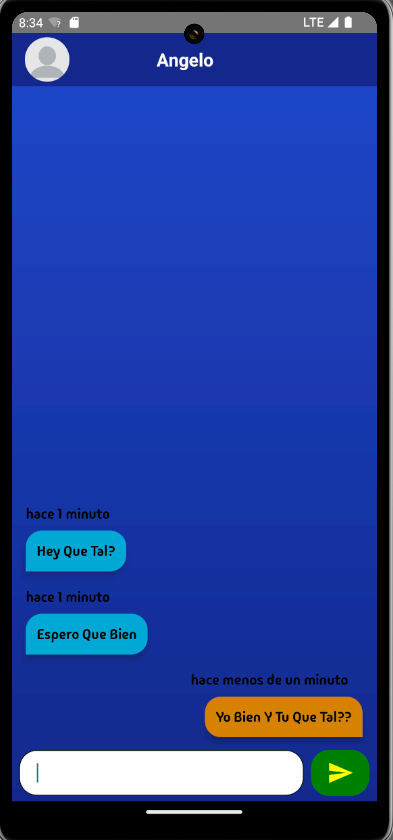
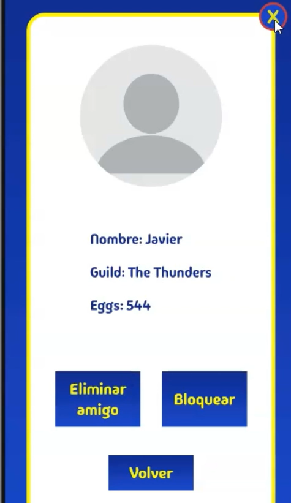

# Manual Del Usuario Antscape

## 1. login y register

estas pantallas es lo primero que ves al entrar a la aplicación, tendrás que registrarte en caso de no tener cuenta. te podrás mover entre las pantallas a través de los enlaces de abajo.

cuando te registres te llegará un correo que tendrás que abrir y verificar a través del enlace que te pondrá allí. después de hacer eso podrás iniciar sesión.

## 2. hormiguero personal

al iniciar sesión llegarás a esta pantalla. podrás apreciar una “rama” que tiene una barra de carga. dicha barra de carga dará dinero cada vez que se complete.

en la parte superior se puede ver tu foto de perfil, tus huevos que son la moneda normal y los huevos de oro que son la moneda para la parte del gremio.

en la parte de abajo hay unos iconos que te permitirán navegar por la aplicación.

en la “rama” hay un botón que pone mejorar, el cual abrirá una pestaña que te permitirá hacer varias cosas.

pulsando el botón de nueva rama pagarás la suma especificada y a cambio se abrirá una nueva rama para poder conseguir más dinero.

dependiendo de si el usuario tiene clan o no, dispondrá de una mejora basada en el nivel de la estructura del clan.

pulsando el botón de mejorar se abrirá un modal. en él, el usuario podrá ver los datos de la rama y subirla de nivel para avanzar en el juego.

## 3. pantalla del clan 

si entras en la pantalla del clan y no perteneces a ninguno, podrás escoger entre dos opciones: buscar o crear un clan.

### 3.1 buscar clan 

en caso de escoger la opción de buscar un clan, le saldrá un listado de los susodichos.

### 3.2 crear un clan

en el caso opuesto, para crear un clan tendrás que escoger tanto un nombre como imagen y descripción.

esta es la pantalla que verás en caso de unirte o de crear un clan. aquí verás varias cosas.

en los botones de arriba podrás:
- ver la pantalla del clan
- el nombre del clan
- las copas del clan
- modificar el número de defensa del clan en caso de ser el líder

todos los clanes cuentan con tres estructuras. pulsando en ellas se desplegará un modal para poder ver sus datos, beneficios y para mejorarlas.

#### 3.2.1 esta estructura sirve para mejorar la cantidad de tiradas que puedes usar para atacar.

#### 3.2.2 esta estructura sirve para mejorar la cantidad de recursos que generas.

#### 3.2.3 esta estructura sirve para mejorar el rango de defensa del clan.

## 4. ataque a otros clanes

pulsando el icono de la espada que estaba en la pantalla anterior irás a esta pantalla que es la de ataque.

aquí podrás ver tanto la defensa enemiga como los dados restantes y el total abajo, para sacar un nuevo dado solo tendrás que pulsar abajo para tirar.

el sistema de ataque consiste en ir tirando dados para intentar aproximarte lo máximo posible a un número secreto comprendido entre el rango que aparece en la parte superior de la pantalla, hay tres tipos de resultado posibles al atacar.

los resultados posibles son:

### 4.1 derrota

### 4.2 victoria pírrica

### 4.3 victoria heroica

cada una dará diferentes recursos.

la derrota ocurre cuando el resultado de tus tiradas queda a más de 2 de distancia del número del clan rival.

la victoria pírrica ocurre cuando el resultado de tus tiradas queda a 2 de distancia o uno del número del clan rival.

la victoria heroica ocurre cuando el resultado de tus tiradas coincide exactamente con el número del clan rival.

## 5. pantalla social

en esta pantalla se encuentra todo el apartado social, un listado de los usuarios, uno de los amigos y otro de los clanes.

## 6. chat entre usuarios

desde la pantalla anterior también podrás entrar en el chat de usuario a usuario en el que se ve tanto el mensaje como cuando fue enviado, siempre y cuando ese usuario no te haya bloqueado o tú lo hayas bloqueado.

## 7. perfil del usuario

este es el perfil de un usuario, en el puedes bloquear o agregar como amigo al usuario.
